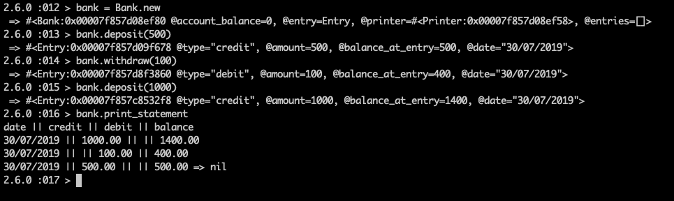
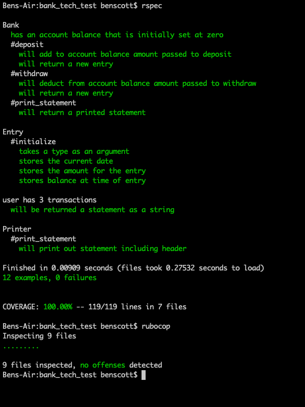

# Bank Tech Test

## Specification
### Requirements
* You should be able to interact with your code via a REPL like IRB or the JavaScript console. (You don't need to implement a command line interface that takes input from STDIN.)
* Deposits, withdrawal.
* Account statement (date, amount, balance) printing.
* Data can be kept in memory (it doesn't need to be stored to a database or anything

### Acceptance criteria

**Given** a client makes a deposit of 1000 on 10-01-2012  
**And** a deposit of 2000 on 13-01-2012  
**And** a withdrawal of 500 on 14-01-2012  
**When** she prints her bank statement  
**Then** she would see

```
date || credit || debit || balance
14/01/2012 || || 500.00 || 2500.00
13/01/2012 || 2000.00 || || 3000.00
10/01/2012 || 1000.00 || || 1000.00
```
### Input/ Output
Input type will be method_name(integer)
Output type will be a String

For example:
Input: deposit(1000)
Output:
'date || credit || debit || balance /n14/01/2012 || || 500.00 || 2500.00/n13/01/2012 || 2000.00 || || 3000.00/n10/01/2012 || 1000.00 || || 1000.00'

### Approach
My approach will be to TDD a program that will allow the user to interact with it inside of a REPL such as IRB. The program will have clear, concise code that will be easily expandable.

I've separated my classes so that they have clear responsibility and would be easily expanded on or changed to suit the clients specific needs.

### To Get Started
Clone this repo
```
git clone git@github.com:bengscott2/tech_test_bank.git
```

run bundle to install dependencies

```
bundle install
```

start irb and require bank file

```
irb -r ./lib/bank.rb
```

Here's a screenshot of a typical use



### Testing
Testing is done using RSpec, SimpleCov and Rubocop(linter)

To run the tests
```
rspec
```
That will show you the passing tests as well as the code coverage which is %100.
To see the linter has no offences
```
rubocop
```
Here's a screenshot of test coverage


